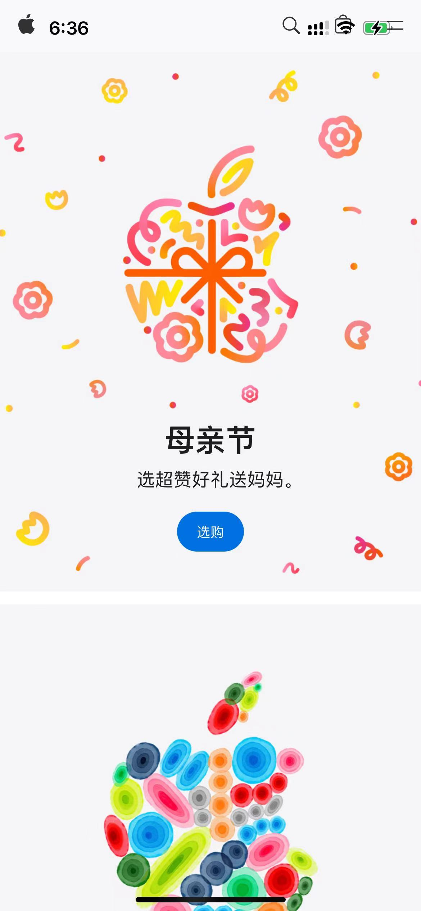

```swift
import UIKit
import WebKit

class ViewController: UIViewController {
    var webView: WKWebView!

    override func viewDidLoad() {
        super.viewDidLoad()
        // Do any additional setup after loading the view.
        let configration = WKWebViewConfiguration()
        
        webView = WKWebView(frame: view.bounds, configuration: configration)
        
        let url = URL(string: "https://www.apple.com.cn")!
        webView.load(URLRequest(url: url))
        webView.allowsBackForwardNavigationGestures = true
        
        view.addSubview(webView)
    }
}
```

效果如下:


点击可以打开链接，左滑可以回到上一个页面
但是有一点瑕疵，页面的最上方会覆盖状态栏，该问题的解决见下文分解